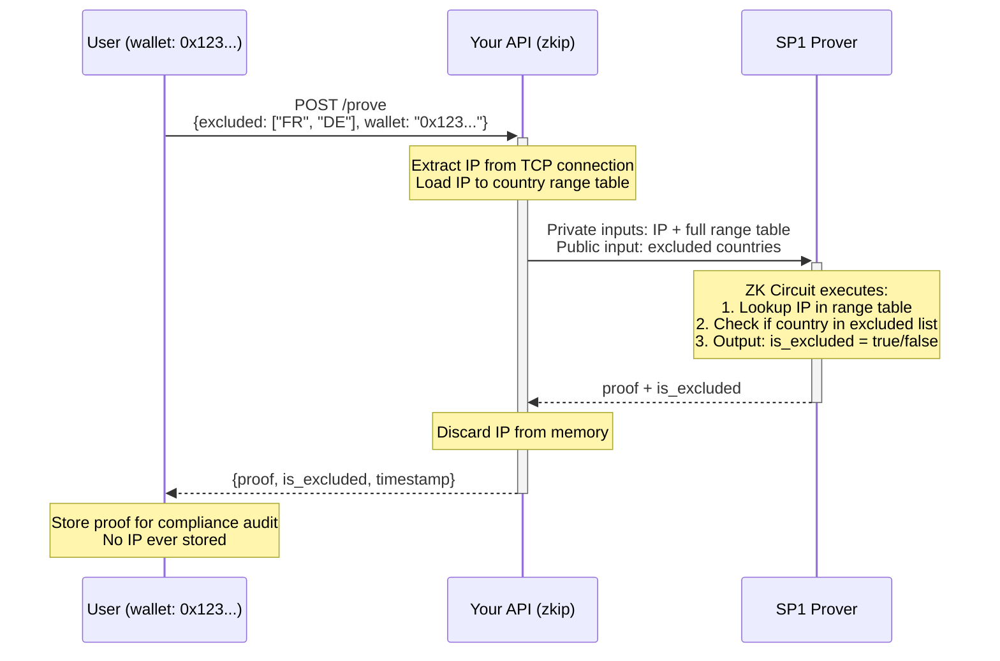

# 🦀 zkip

> Note: zkip is brand new and actively under development. Things will change and bugs may exist. If you find any bugs or have any feature requests, please open an issue.

zkip is a zero-knowledge proof library for proving a user's IP address is **not** from a specified set of countries without revealing the actual IP address. Built with [SP1](https://github.com/succinctlabs/sp1) zkVM.

## Motivation

Many businesses and developers end up storing IP addresses for various reasons:

- Regulatory compliance (tax laws, content licensing, gambling restrictions)
- Proving user location to auditors
- Fraud prevention and geo-restrictions
- Analytics and service customization

But storing IP addresses creates privacy concerns and GDPR obligations. **What if you could prove location without storing the IP?**

(For example: In France, digital service providers must charge VAT on all sales unless they can prove the customer's location. This typically requires storing IP addresses, which is a privacy concern.)

**zkip's solution**: Generate a zero-knowledge proof that verifies "this IP is not from countries X, Y, Z" without revealing or storing the actual IP address. You get verifiable location proofs while keeping user data private.

## How It Works

```
┌─────────────────────────────────────────────────────────────────────────────┐
│                              ARCHITECTURE                                    │
└─────────────────────────────────────────────────────────────────────────────┘

┌──────────────┐     POST /prove            ┌──────────────────┐
│              │   {excluded: ["FR","DE"]}  │                  │
│    User      │ ─────────────────────────▶ │    Your API      │
│  (Browser)   │                            │     (zkip)       │
│              │                            │                  │
│  IP: hidden  │                            │ Extracts IP from │
│              │                            │ TCP connection   │
└──────────────┘                            └────────┬─────────┘
       ▲                                             │
       │                                             │ IP + country ranges
       │                                             │ (private inputs)
       │                                             ▼
       │                                    ┌──────────────────┐
       │                                    │                  │
       │   {                                │   SP1 Prover     │
       │     is_excluded: true,             │   (local or      │
       │     proof: "0xabc...",             │    network)      │
       │     timestamp: "..."               │                  │
       │   }                                │ Runs ZK circuit: │
       │                                    │ IP ∉ excluded?   │
       └────────────────────────────────────┴──────────────────┘

┌─────────────────────────────────────────────────────────────────────────────┐
│                           WHAT GETS STORED                                   │
├─────────────────────────────────────────────────────────────────────────────┤
│  ✅ Cryptographic proof                                                      │
│  ✅ Boolean result (is_excluded)                                             │
│  ✅ User identifier (e.g., wallet address)                                   │
│  ✅ Timestamp                                                                │
│                                                                              │
│  ❌ IP address (never stored)                                                │
│  ❌ Actual country (never revealed)                                          │
└─────────────────────────────────────────────────────────────────────────────┘
```

## Flow



## Project Structure

```
zkip/
├── lib/              # Shared code (types and functions used by both program and script)
│   └── src/lib.rs    # IP range types, country check logic
├── program/          # The ZK program (compiles to RISC-V, runs inside SP1 zkVM)
│   └── src/main.rs   # Reads IP, checks ranges, outputs boolean
├── script/           # CLI for testing and generating proofs
│   └── src/bin/
│       ├── main.rs   # Execute or prove the program
│       ├── evm.rs    # Generate EVM-compatible proofs (Groth16/PLONK)
│       └── vkey.rs   # Export verification key for on-chain use
```

### Crate Responsibilities

| Crate       | Purpose                                   | Compilation Target         |
| ----------- | ----------------------------------------- | -------------------------- |
| **lib**     | Shared types and functions (used by both) | Standard Rust (testable)   |
| **program** | ZK circuit that runs inside SP1 zkVM      | RISC-V (via `cargo prove`) |
| **script**  | CLI to trigger execution/proving          | Standard Rust              |

The `lib` crate is optional but recommended. It lets you share types (like `PublicValuesStruct`) between the program and script, and test your logic without compiling to RISC-V.

## Requirements

- [Rust](https://rustup.rs/)
- [SP1](https://docs.succinct.xyz/docs/sp1/getting-started/install)

## Quick Start

### 1. Build the Program

```sh
cd program && cargo prove build
```

Or let it build automatically when running the script.

### 2. Execute (No Proof)

Test the logic without generating a proof:

```sh
cd script
cargo run --release -- --execute
```

### 3. Generate a Proof

```sh
cd script
cargo run --release -- --prove
```

### 4. Use the Prover Network

For faster proving:

```sh
cp .env.example .env
# Set SP1_PROVER=network and NETWORK_PRIVATE_KEY=...

cd script
cargo run --release -- --prove
```

### 5. Generate EVM-Compatible Proof

For on-chain verification (requires 16GB+ RAM):

```sh
cd script
cargo run --release --bin evm -- --system groth16
```

## API Design (Future)

```
POST /prove

Request:
{
  "excluded_countries": ["FR", "DE", "IT"],  // Countries to prove absence from
  "user_id": "0x123..."                      // Optional: wallet or identifier
}

Response:
{
  "is_excluded": true,                       // IP not in any excluded country
  "proof": "0xabc...",                       // ZK proof
  "timestamp": "2025-12-18T12:00:00Z"
}
```

## Current Status

🚧 **Proof of Concept**

### Phase 1 (Current): ZK Proof Core

- [ ] IP range data structure
- [ ] Multi-country exclusion logic
- [ ] ZK circuit implementation
- [ ] CLI testing

### Phase 2 (Future): API Server

- [ ] REST API endpoint
- [ ] IP extraction from HTTP request
- [ ] Proof generation service

### Phase 3 (Future): Client Integration

- [ ] Wallet connection
- [ ] Frontend integration

## Privacy Model

| Party              | Sees IP?                 | Stores IP? |
| ------------------ | ------------------------ | ---------- |
| User               | ✅ (their own)           | N/A        |
| Your Server        | ✅ (transient in memory) | ❌ No      |
| SP1 Prover Network | ✅ (during computation)  | ❌ No      |

**Note**: The SP1 Prover Network is a compute service, not a blockchain. Inputs are processed in memory and discarded after proof generation.

## License

MIT
