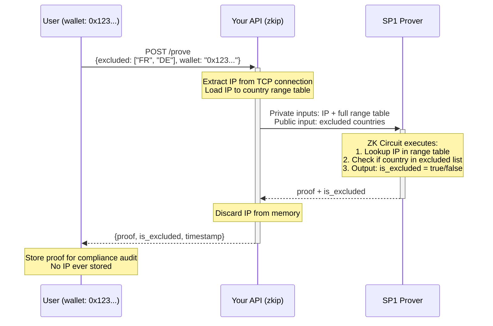

# Flow

```mermaid
sequenceDiagram
    participant User as User (wallet: 0x123...)
    participant API as Your API (zkip)
    participant Prover as SP1 Prover

    User->>+API: POST /prove<br/>{excluded: ["FR", "DE"], wallet: "0x123..."}
    Note over API: Extract IP from TCP connection<br/>Load IP to country range table

    API->>+Prover: Private inputs: IP + full range table<br/>Public input: excluded countries
    Note over Prover: ZK Circuit executes:<br/>1. Lookup IP in range table<br/>2. Check if country in excluded list<br/>3. Output: is_excluded = true/false
    Prover-->>-API: proof + is_excluded

    Note over API: Discard IP from memory
    API-->>-User: {proof, is_excluded, timestamp}

    Note over User: Store proof for compliance audit<br/>No IP ever stored
```
